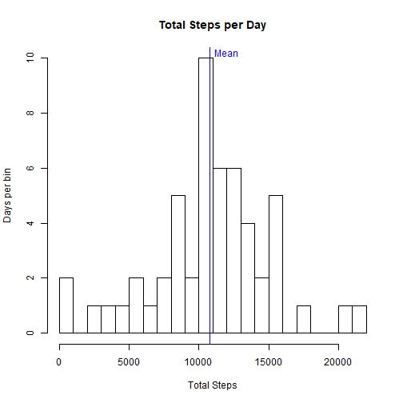
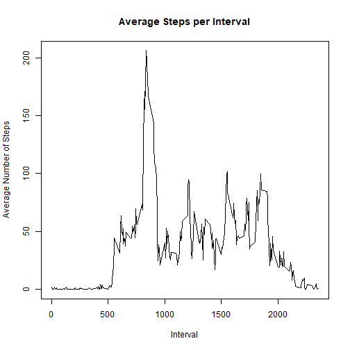
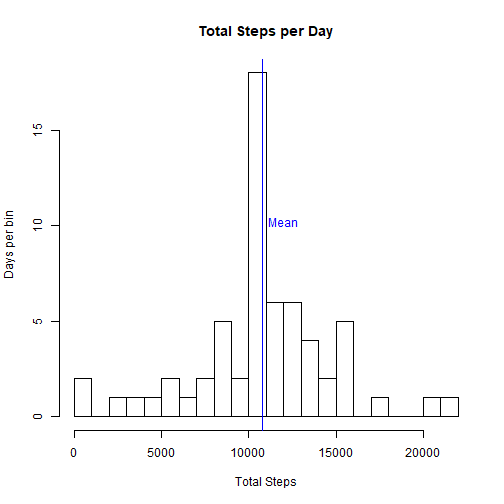
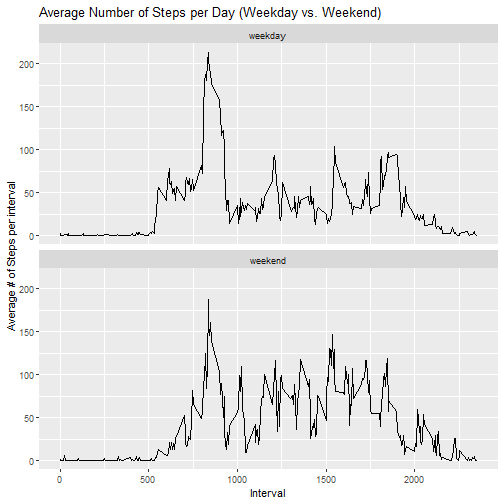

Reproducible Research Course Project 1
======================================

Requirements for project:  
- Submit github repository URL  
- Submit SHA-1 hash  
  
Variables in dataset:  
- steps: number sets per 5 min interval  
- date: YYYY-MM-DD  
- interval: identifier for 5 min interval  
  
Tips:  
- Always use echo = TRUE  
- feel free to use any plotting system  
  
Load and preprocess Data

```r
activity <- read.csv("activity.csv")
activity$date <- as.Date(activity$date)
head(activity)
```

```
##   steps       date interval
## 1    NA 2012-10-01        0
## 2    NA 2012-10-01        5
## 3    NA 2012-10-01       10
## 4    NA 2012-10-01       15
## 5    NA 2012-10-01       20
## 6    NA 2012-10-01       25
```

# Mean total steps  
Calculate the mean/median total number of steps per day and plot histogram

```r
Total_steps <- aggregate(activity["steps"],FUN=sum,by = activity["date"])
head(Total_steps)
```

```
##         date steps
## 1 2012-10-01    NA
## 2 2012-10-02   126
## 3 2012-10-03 11352
## 4 2012-10-04 12116
## 5 2012-10-05 13294
## 6 2012-10-06 15420
```

```r
hist(Total_steps$steps,breaks = 20,main = "Total Steps per Day",
     xlab="Total Steps",ylab="Days per bin")
abline(v = mean(Total_steps$steps,na.rm = TRUE),col = "blue",lwd = 1)
text(y= 10.2, x = mean(Total_steps$steps,na.rm = TRUE)+1300,labels = "Mean ",
        col = "blue")
```



```r
mean(Total_steps$steps,na.rm = TRUE)
```

```
## [1] 10766.19
```

```r
median(Total_steps$steps,na.rm = TRUE)
```

```
## [1] 10765
```
 

##What is the average daily activity pattern?
Make a time series plot of the five min intervals(x-axis) and the average #  
of steps taken,averaged accross all days(y-axis).  
Determine which 5 min interval, on average, contains max number of steps.

```r
activity_per_interval <- aggregate(activity["steps"],FUN = mean,
                                     by = activity["interval"],na.rm = TRUE)
head(activity_per_interval)
```

```
##   interval     steps
## 1        0 1.7169811
## 2        5 0.3396226
## 3       10 0.1320755
## 4       15 0.1509434
## 5       20 0.0754717
## 6       25 2.0943396
```

```r
#Plot average steps vs. interval
plot(activity_per_interval$interval, activity_per_interval$steps, type="l",
     xlab = "Interval", ylab = "Average Number of Steps", 
     main = "Average Steps per Interval")
```



```r
index <- which.max(activity_per_interval$steps)

#Interval with Maximum average steps
activity_per_interval$interval[index]
```

```
## [1] 835
```

## Imputing Missing Values:  
1 Calculate total # of missing values (NA)  
2 Devise strategy for filling all missing values  
3 Use mean for that five minute interval  
4 Create new dataset with the missing data filled  
5 Make a histogram of total # of steps  
6 Calculate mean and median  
7 Do these values differ from the estimates from the first part?  
8 What is the impact of imputing the data?  


```r
#total NA values
total_nas <- sum(is.na(activity$steps))
total_nas
```

```
## [1] 2304
```

```r
#Fill NA values with mean for that interval
activity_NAs <- activity[is.na(activity$steps),]
head(activity_NAs)
```

```
##   steps       date interval
## 1    NA 2012-10-01        0
## 2    NA 2012-10-01        5
## 3    NA 2012-10-01       10
## 4    NA 2012-10-01       15
## 5    NA 2012-10-01       20
## 6    NA 2012-10-01       25
```

```r
for(x in 1:nrow(activity_NAs)){
	index <- which(activity_per_interval["interval"] == activity_NAs[x,"interval"])
	activity_NAs[x,"steps"] = activity_per_interval[index,"steps"]
}
head(activity_NAs)
```

```
##       steps       date interval
## 1 1.7169811 2012-10-01        0
## 2 0.3396226 2012-10-01        5
## 3 0.1320755 2012-10-01       10
## 4 0.1509434 2012-10-01       15
## 5 0.0754717 2012-10-01       20
## 6 2.0943396 2012-10-01       25
```

```r
#bind dataframes
new_activity <- rbind(activity_NAs,activity)
new_activity <- new_activity[complete.cases(new_activity),]

# Create histogram
Total_steps2 <- aggregate(new_activity["steps"],FUN=sum,by = activity["date"])

hist(Total_steps2$steps,breaks = 20,main = "Total Steps per Day",
     xlab="Total Steps",ylab="Days per bin")
abline(v = mean(Total_steps2$steps),col = "blue",lwd = 1)
text(y= 10.2, x = mean(Total_steps2$steps)+1300,labels = "Mean ",
        col = "blue")
```



```r
mean(Total_steps2$steps)
```

```
## [1] 10766.19
```

```r
median(Total_steps2$steps)
```

```
## [1] 10766.19
```

The mean of the data did not change once the NA values was removed since the imputed data was based on the mean for each interval 
The median did rise just by a little from 10765 to 10766.19.

## Are there differences in activity patterns between weekdays and weekends?
Use the weekdays() function.  
1. Create a new factor variable with two levels ("weekday" & "weekend")  
2. Make a panel plot containing a time series plot (type = "l") for the 5 minute intervals(x-axis) and the average # of steps taken averaged across all weekday days or weekend days(y-axis)

```r
# create new weekday factor
library(plyr)
library(dplyr)
```

```
## Warning: package 'dplyr' was built under R version 3.6.3
```

```
## 
## Attaching package: 'dplyr'
```

```
## The following objects are masked from 'package:plyr':
## 
##     arrange, count, desc, failwith, id, mutate, rename, summarise, summarize
```

```
## The following objects are masked from 'package:stats':
## 
##     filter, lag
```

```
## The following objects are masked from 'package:base':
## 
##     intersect, setdiff, setequal, union
```

```r
new_activity$day <- as.factor(grepl("S.+",weekdays(activity$date)))
day_levels = levels(new_activity$day)
day = c("weekday","weekend")
new_activity$day <- mapvalues(new_activity$day,day_levels,day)

#Calculate 

head(new_activity)
```

```
##       steps       date interval     day
## 1 1.7169811 2012-10-01        0 weekday
## 2 0.3396226 2012-10-01        5 weekday
## 3 0.1320755 2012-10-01       10 weekday
## 4 0.1509434 2012-10-01       15 weekday
## 5 0.0754717 2012-10-01       20 weekday
## 6 2.0943396 2012-10-01       25 weekday
```

```r
new_activity_by_interval <- new_activity %>%
        group_by(interval,day) %>%
        summarize(average_steps = mean(steps))
head(new_activity_by_interval,288)
```

```
## # A tibble: 288 x 3
## # Groups:   interval [144]
##    interval day     average_steps
##       <int> <fct>           <dbl>
##  1        0 weekday       2.03   
##  2        0 weekend       0.840  
##  3        5 weekday       0.445  
##  4        5 weekend       0.0425 
##  5       10 weekday       0.173  
##  6       10 weekend       0.0165 
##  7       15 weekday       0.198  
##  8       15 weekend       0.0189 
##  9       20 weekday       0.0990 
## 10       20 weekend       0.00943
## # ... with 278 more rows
```

```r
# Make panel plot
par(mfrow = c(1,2))
par(mar=c(5,4,1,1))
library(ggplot2)
intervalplot <- ggplot(data = new_activity_by_interval,aes(x=interval,y = average_steps))+
        geom_line() +
        ggtitle("Average Number of Steps per Day (Weekday vs. Weekend)")+
        xlab("Interval")+
        ylab("Average # of Steps per interval")
intervalplot + facet_wrap(.~day,nrow=2)
```



